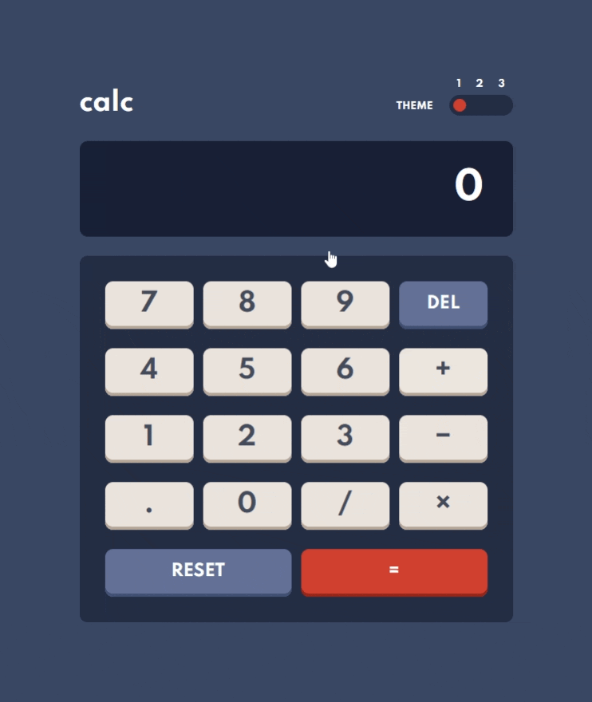

# Frontend Mentor - Calculator app solution

This is a solution to the [Calculator app challenge on Frontend Mentor](https://www.frontendmentor.io/challenges/calculator-app-9lteq5N29). Frontend Mentor challenges help you improve your coding skills by building realistic projects. 

## Table of contents

- [Overview](#overview)
  - [The challenge](#the-challenge)
  - [Screenshot](#screenshot)
  - [Links](#links)
- [My process](#my-process)
  - [Built with](#built-with)
  - [What I learned](#what-i-learned)
  - [Issues + Continued development](#continued-development)
  - [Useful resources](#useful-resources)
- [Author](#author)

## Overview

### The challenge

Users should be able to:

- See the size of the elements adjust based on their device's screen size
- Perform mathmatical operations like addition, subtraction, multiplication, and division
- Adjust the color theme based on their preference
- **Bonus**: Have their initial theme preference checked using `prefers-color-scheme` and have any additional changes saved in the browser

### Screenshot



### Links

- [View the solution of Frontend Mentor](https://www.frontendmentor.io/solutions/calculator-app-html-css-js-tried-to-focus-on-accessibility-2yw2AOpoa)
- [View live demo](https://calculator-color-schemes.vercel.app/)

## My process

### Built with

- CSS custom properties
- CSS Grid
- Mobile-first workflow
- JavaScript

### What I learned

- How to add color themes to the project using CSS variables.

- How to check for `prefers-color-scheme` media feature with JavaScript. I decided to use the dark color scheme so in the function below I am checking for `prefers-color-scheme: light` and only changing the initial theme if this is true.
```js
function setInitialTheme() {
    const darkInput = document.getElementById('dark');
    const lightInput = document.getElementById('light');

    const userPrefersLight = window.matchMedia && window.matchMedia('(prefers-color-scheme: light)').matches;

    if (userPrefersLight) {
      lightInput.setAttribute('checked', '');
      setTheme('light-theme');
    } else {
        darkInput.setAttribute('checked', '');
        setTheme('dark-theme');
    }
}
```

- How to create a 3-step accessible toggle switch base on radio inputs.

- Accessible Layout Grid for accessible keyboard navigation - [Based on the patterns described here](https://www.w3.org/TR/2017/NOTE-wai-aria-practices-1.1-20171214/examples/grid/LayoutGrids.html). This pattern utilises `role="grid"` to notify screen reader users that the element has a grid widget. Only the first element in the grid is focusable. All other elements are focusable through scripting.
```html
<div class="calc__keypad" id="keypad" role="grid" aria-label="Calculator Keypad">
  <div role="row" class="calc__keypad__row">
    <span role="gridcell" class="calc__keypad__gridcell">
      <button class="calc__btn btn-num js-calc-btn" id="7" tabindex="0">7</button>
    </span>
    <span role="gridcell" class="calc__keypad__gridcell">
      <button class="calc__btn btn-num js-calc-btn" id="8" tabindex="-1">8</button>
    </span>
    <span role="gridcell" class="calc__keypad__gridcell">
      <button class="calc__btn btn-num js-calc-btn" id="9" tabindex="-1">9</button>
    </span>
    <span role="gridcell" class="calc__keypad__gridcell">
      <button class="calc__btn btn-func js-calc-btn" id="Backspace" tabindex="-1">del</button>
    </span>
  </div>
```

- Following the example linked above, I also added a new user experience helper (NUX) which explains how the keypad can be navigated with keyboard. It is displayed when the first button in the grid receives focus for the first time, if that focus was reached with keyboard (clicking the button will not trigger NUX). 
```js
const showInstructions = () => {
    if (mouseDown) {
        e.target.blur();
    } else {
        firstGridBtn.removeEventListener('focus', showInstructions);
        NUX.classList.remove('hidden');
        NUX.focus();
    }
}
```

- Unfortunately due to differences between screen readers, this solution is not perfect. When testing it with NVDA screen reader, I realised that the screen reader defines custom behaviour for arrow keys, and overriding it seems counterproductive. I will need to learn more about the differences between different screen readers to be able to plan for this.

- 

### Issues + Continued development

I significantly underestimated the time this challenge would take. I think taking more time to plan the behaviour of the app would help me avoid time-consuming corrections.

I also want to learn more about the behaviour of different screen readers, to be more aware of issues like the one described above with NVDA.

### Useful resources

- [Example resource 1](https://medium.com/@haxzie/dark-and-light-theme-switcher-using-css-variables-and-pure-javascript-zocada-dd0059d72fa2) - This article helped me understand how to switch themes very easily.
- [How to detect if the user prefers a light or dark color schema with JavaScript](https://ourcodeworld.com/articles/read/1114/how-to-detect-if-the-user-prefers-a-light-or-dark-color-schema-in-the-browser-with-javascript-and-css) - And this one gives advice on how to detect the in-browser color schema preference with JavaScript.
- [My starting point to creating the 3-step toggle switch was this Frontend Mentor solution by Grace Snow](https://www.frontendmentor.io/solutions/accessible-toggle-in-html-css-and-js-with-explanatory-notes-Z6gD3qfGl) - I have used this accessible pattern before in another challenge which made it a lot easier.

## Author

- Frontend Mentor - [@AgataLiberska](https://www.frontendmentor.io/profile/AgataLiberska)
- Twitter - [@AgataLiberska](https://www.twitter.com/AgataLiberska)